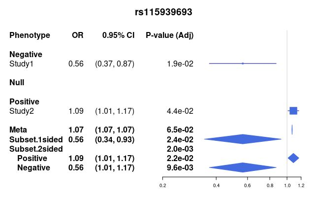

# ASSET
Created by: Yazdan Asgari<br>
Creation date: 7 May 2021<br>
Update: 13 Feb 2024<br>
https://cesp.inserm.fr/en/equipe/exposome-and-heredity
<br>
<br>
**Ref:** Bhattacharjee et al., "A Subset-Based Approach Improves Power and Interpretation for the Combined Analysis of Genetic Association Studies of Heterogeneous Traits",
Am J Hum Genet. 2012 May 4; 90(5): 821–835., doi:10.1016/j.ajhg.2012.03.015 [Paper_link](https://www.ncbi.nlm.nih.gov/pmc/articles/PMC3376551/)
<br>
<br>
Here is an example of running ASSET for two studies (first 1000 rows from the BCAC & EPITHYR)
<br>
<br>
- First, we need to call the ASSET package in the R programming language:
```r
library('ASSET')
```
As we mentioned earlier, we bring an example of running ASSET on two different studies
<br>
**NOTE:** To run the code faster, we just considered the first 1000 rows from the BCAC & EPITHYR data
<br>
The input should include GWAS summary statistics data
<br>
Head of the BCAC GWAS summary statistics data (input data)
<br>
| snp | hg18chr | bp | a1 | a2 | beta | se | pval | info | ngt | CEUaf |
| -- | -- | -- | -- | -- | -- | -- | -- | -- | -- | -- |
rs376342519 | 1 | 10616 | CCGCCGTTGCAAAGGCGCGCCG | C | 9e-05 | 0.05784 | 0.9987 |  0.837659 | 0 | 0.00749 |
1:13110:G:A | 1 | 13110 | G | A  | 0.02066 | 0.03231 | 0.52245 | 0.369693 | 0 | 0.0556 |
rs201725126 | 1 | 13116 | T | G  | 0.01255 | 0.01895 | 0.50772 | 0.389655 | 0 | 0.175 |
rs200579949 | 1 | 13118 | A | G   | 0.01255 | 0.01895 | 0.50772 | 0.389655 | 0 | 0.175 |
1:13550:G:A | 1 | 13550 | G  | A  | -0.13184 | 0.11236 | 0.24066 | 0.287681 | 0 | 0.0056 |

Head of the EPITHYR GWAS summary statistics data (input data)
<br>
| snp | hg18chr | bp | a1 | a2 | beta | se | pval | info | ngt | CEUaf |
| -- | -- | -- | -- | -- | -- | -- | -- | -- | -- | -- |
1:51762:A:G | 1 | 51762 | A | G | 0.19 | 0.246 | 0.434 |  0.632 | 0 | 0.0161 |
rs13328684 | 1 | 74792 | G | A  | 0.445 | 0.190 | 0.019 | 0.507 | 0 | 0.0345 |
rs28619159 | 1 | 91421 | T | C  | 0.547 | 0.231 | 0.0180 | 0.725 | 0 | 0.016 |
rs377100675 | 1 | 125271 | C | T | 0.0626 | 0.1918 | 0.743 | 0.525 | 0 | 0.032 |
rs3094315 | 1 | 752566 | G  | A  | 0.0924 | 0.0695 | 0.183 | 1 | 0 | 0.1698 |

- Reading input data, sorting, and adding some filtering (CEUaf>=0.01 & info>=0.9)
```r
# The Path for the input data 
path='YOUR_DESIRE_PATH'
# reading BCAC data, sorting, and adding some filtering (CEUaf>=0.01 & info>=0.9)
tb=read.table(paste('',path,'bcac.onco.ALL.reformated.txt', sep=''),header=TRUE, as.is=TRUE)
tb=tb[order(tb$bp),]
tb=tb[order(tb$hg18chr),]
tb=tb[which(tb$CEUaf>=0.01 & tb$info>=0.9),]
tb=tb[1:1000,]

# reading EPITHYR data, sorting, and adding some filtering (CEUaf>=0.01 & info>=0.9)
te=read.table(paste('',path,'epithyr.ALL.reformated.txt', sep=''),header=TRUE, as.is=TRUE)
te=te[order(te$bp),]
te=te[order(te$hg18chr),]
te=te[which(te$CEUaf>=0.01 & te$info>=0.9),]
te=te[1:1000,]
```
After reading the input data, the following steps should be run on the imported data:
<br>
- extraction of common SNPs between two databases
- check of common SNPs between de & db (rows should be the same)
- check of uncommon SNPs between de & db (the result should be Zero)
- building the parameter for running ASSET based on the original GWAS data
```r
# extraction of common SNPs between two databases
de=te[which(te$snp %in% tb$snp),]
db=tb[which(tb$snp %in% te$snp),]

# check of common SNPs between de & db (rows should be the same)
nrow(de)
nrow(db)
# check of uncommon SNPs between de & db (the result should be Zero)
which(de$snp != db$snp)

# building the parameter for running ASSET based on the original GWAS data
beta = as.matrix(data.frame(Study1 = de$beta, 
                            Study2 = db$beta, 
                            row.names = db$snp))

sigma = as.matrix(data.frame(Study1 = de$se, 
                             Study2 = db$se, 
                             row.names = db$snp))

case = as.matrix(data.frame(Study1 = rep(1551,length(db$snp)), 
                            Study2 = rep(61282,length(db$snp)), 
                            row.names = db$snp))

control = as.matrix(data.frame(Study1 = rep(1957,length(db$snp)), 
                               Study2 = rep(45494,length(db$snp)), 
                               row.names = db$snp))
SNPs = db$snp
Study=c('Study1','Study2')
```
- Running ASSET (by default, it runs with 2-sided option)
```r
res_ASSET <- h.traits(SNPs, Study, beta, sigma, case, control, meta=TRUE)
```
- Running ASSET for 1-sided option
```r
res_ASSET_2 = h.traits(SNPs, Study, beta, sigma, case, control, meta=TRUE, side=1)
```
- Checking the ASSET results
```r
View(res_ASSET)
res_2sides = h.summary(res_ASSET)$Subset.2sided
head(res_2sides,n=5)
```
**$Subset.2sided**
| No | SNP | Pvalue | Pvalue.1 | Pvalue.2 | OR.1 | CI.low.1 | CI.high.1 | OR.2 | CI.low.2 | CI.high.2 | Pheno.1 | Pheno.2 |
| -- | -- | -- | -- | -- | -- | -- | -- | -- | -- | -- | -- | -- | 
| 1 |  rs4553118 | 0.4875155 | 0.4489083 | 0.3994828 | 1.008 | 0.987 | 1.030 | 0.950 | 0.842 | 1.071 |  Study2 |  Study1 |
| 2 | rs13303211 | 0.2902767 | 0.8047839 | 0.1034814 | 1.016 | 0.898 | 1.148 | 0.982 | 0.962 | 1.004 |  Study1 |  Study2 |
| 3 | rs28752186 | 0.2902767 | 0.8047839 | 0.1034814 | 1.016 | 0.898 | 1.148 | 0.982 | 0.962 | 1.004 |  Study1 |  Study2 |
| 4 | rs28594623 | 0.3264172 | 0.7237075 | 0.1358806 | 1.022 | 0.905 | 1.155 | 0.984 | 0.963 | 1.005 |  Study1 |  Study2 |
| 5 | rs28416910 | 0.3264172 | 0.7237075 | 0.1358806 | 1.022 | 0.905 | 1.155 | 0.984 | 0.963 | 1.005 |  Study1 |  Study2 |

Output could also be as follows for other running purposes (which we did NOT use for our example)
<br>
**$Meta**
| No | SNP | Pvalue | OR | CI.low | CI.high |
| -- | -- | -- | -- | -- | -- |
| 1 | SNP1 | 0.001436399 | 1.094 | 1.092 | 1.096 |
| 2 | SNP2 | 0.052613004 | 1.097 | 1.092 | 1.102 |
| 3 | SNP3 | 0.583876904 | 1.017 | 1.015 | 1.019 |

**$Subset.1sided**
| No | SNP | Pvalue | OR | CI.low | CI.high | Pheno |
| -- | -- | -- | -- | -- | -- | -- | 
| 1 | SNP1 | 5.827155e-07 | 1.243 | 1.141 | 1.354 | STUDY1,STUDY4 |
| 2 | SNP2 | 3.482450e-03 | 1.286 | 1.086 | 1.522 | STUDY2,STUDY4 |
| 3 | SNP3 | 1.688626e-01 | 1.137 | 0.947 | 1.366 | STUDY2 |

- Checking the ASSET results (some other commands)
```r
res_ASSET$Subset.2sided$beta.1["rs2887286"]
dim(res_2sides[which(res_2sides$Pvalue<=0.05),])
dim(res_2sides[which(res_2sides$Pvalue<=0.01),])
dim(res_2sides[which(res_2sides$Pvalue<=0.001),])
dim(res_2sides[which(res_2sides$Pvalue<=0.0001),])
res_2sides[which(res_2sides$Pvalue<=0.0001),]
```
- forestPlot for one specific SNP
```r
h.forestPlot(rlist=res_ASSET,snp.var="rs2887286",level=0.05,p.adj=TRUE,digits=2)
```
<br></br>
<kbd>  </kbd>
<br></br>
- Extracting data from the ASSET results
```r
pleiotropy = rep(0,dim(res_2sides)[1])
sig_p1=which(res_2sides$Pvalue.1<0.05)
sig_p2=which(res_2sides$Pvalue.2<0.05)

pleiotropy[sig_p1]=pleiotropy[sig_p1]+as.numeric(lapply(strsplit(as.character(res_2sides[sig_p1,"Pheno.1"]),split=',', fixed=TRUE),length))
pleiotropy[sig_p2]=pleiotropy[sig_p2]+as.numeric(lapply(strsplit(as.character(res_2sides[sig_p2,"Pheno.2"]),split=',', fixed=TRUE),length))

res_2sides_edit=cbind(res_2sides,pleiotropy)
```
- For saving the results:
```r
# First, define a desired path 
path2='YOUR_DESIRED_PATH'
colnames(res_2sides_edit)<-c('snp',
                             'pval',
                             'pval_p',
                             'pval_n',
                             'OR_p',
                             'CI.l.p',
                             'CI.h.p',
                             'OR_n',
                             'CI.l.n',
                             'CI.h.n',
                             'pheno.p',
                             'pheno.n',
                             'pleiotropy')
write.table(res_2sides_edit,
            paste(path2,"RESULTS_ASSET.txt",sep="/"),
            quote = FALSE,
            sep="\t",
            row.names = FALSE)
```
Here is an example of the saved file:
| snp | pval | pval_p | pval_n | OR_p | CI.l.p | CI.h.p | OR_n | CI.l.n | CI.h.n | pheno.p | pheno.n | pleiotropy |
| -- | -- | -- | -- | -- | -- | -- | -- | -- | -- | -- | -- | -- |
| rs4553118 |	0.487515526277316 |	0.44890834948002 |	0.399482763216693 |	1.008 |	0.987 |	1.03 |	0.95 |	0.842 |	1.071 |	Study2 |	Study1 |	0 |
| rs13303211 |	0.290276747424612 |	0.804783902010406 |	0.10348139777869 |	1.016 |	0.898 |	1.148 |	0.982 |	0.962 |	1.004 |	Study1 |	Study2 |	0 |
| rs28752186 |	0.290276747424612 |	0.804783902010406 |	0.10348139777869 |	1.016 |	0.898 |	1.148 |	0.982 |	0.962 |	1.004 |	Study1 |	Study2 |	0 |
| rs2245754 |	0.519256032303008 |	0.469061240781735 |	0.422906545556955 |	1.062 |	0.902 |	1.252 |	0.989 |	0.961 |	1.017 |	Study1 |	Study2 |	0 |
| rs9331226 |	0.0218474658897554 |	0.17149612168726 |	0.018928364783646 |	1.074 |	0.97 |	1.189 |	0.978 |	0.961 |	0.996 |	Study1 |	Study2 |	1 |
| rs150915126 |	0.479603359796809 |	0.458001093872487 |	0.381573905705021 |	1.064 |	0.903 |	1.254 |	0.987 |	0.96 |	1.016 |	Study1 |	Study2 |	0 | 
| rs13303240 |	0.0223588896180916 |	0.167504890492657 |	0.0199134696179346 |	1.075 |	0.97 |	1.19 |	0.979 |	0.961 |	0.997 |	Study1 |	Study2 |	1 | 
| rs9442393 |	0.0208696690046042 |	0.220445396259138 |	0.0139549018888754 |	1.066 |	0.962 |	1.181 |	0.977 |	0.959 |	0.995 |	Study1 |	Study2 |	1 |
| rs114129418 |	0.557024294665911 |	0.247555158099992 |	0.899179468338123 |	1.274 |	0.845 |	1.92 |	0.995 |	0.919 |	1.077 |	Study1 |	Study2 |	0 |
| rs115939693 |	0.0019781655218357 |	0.0218258495255031 |	0.0095664562943026 |	1.086 |	1.012 |	1.166 |	0.564 |	0.366 |	0.87 |	Study2 |	Study1 |	2 |
| rs2031709 |	0.677872291109891 |	0.535560337891846 |	0.586538057936861 |	1.125 |	0.775 |	1.633 |	0.981 |	0.914 |	1.052 |	Study1 |	Study2 |	0 |
| rs2887286 |	0.0259089968019105 |	0.0259089968019105 |	1 |	1.03 |	1.004 |	1.057 |	NA |	NA |	NA |	Study1,Study2 |	 |	2 |
| rs113991671 |	0.0706254633035534 |	0.0170007098698062 |	0.780544936290919 |	1.025 |	1.004 |	1.046 |	0.983 |	0.875 |	1.106 |	Study2 |	Study1 |	1 |
| rs7526076 |	0.0574664154793528 |	0.842768102800309 |	0.012231386246503 |	1.012 |	0.901 |	1.136 |	0.975 |	0.956 |	0.994 |	Study1 |	Study2 |	1 |
| rs4075116 |	0.031532356482835 |	0.609888737070071 |	0.00821083526003521 |	1.031 |	0.918	| 1.157 |	0.973 |	0.954 |	0.993 |	Study1 |	Study2 |	1 |
| rs4073176 |	0.0254003753587747 |	0.336497964274867 |	0.0115192506674362 |	1.052 |	0.948 |	1.167 |	0.976	| 0.959 |	0.995 | Study1 |	Study2 |	1 |
| rs4073177 |	0.0253979142533489 |	0.336459488997903 |	0.0115192506674362 |	1.052 |	0.948 |	1.167 |	0.976 |	0.959 |	0.995 |	Study1 |	Study2 |	1 |
| rs9442394 |	0.0249585792995359 |	0.360923363628306 |	0.0105196586172951 |	1.05 |	0.946 |	1.165 |	0.976 |	0.958	| 0.994 |	Study1 |	Study2 |	1 |

**IMPORTANT NOTE:** Always remember to save the sessionInfo results for your code and keep it in your running folder
<br>
**sessionInfo()**
```r
> sessionInfo()
R version 3.6.0 (2019-04-26)
Platform: x86_64-redhat-linux-gnu (64-bit)
Running under: CentOS Linux 7 (Core)

Matrix products: default
BLAS/LAPACK: /usr/lib64/R/lib/libRblas.so

locale:
 [1] LC_CTYPE=fr_FR.UTF-8       LC_NUMERIC=C               LC_TIME=fr_FR.UTF-8        LC_COLLATE=fr_FR.UTF-8    
 [5] LC_MONETARY=fr_FR.UTF-8    LC_MESSAGES=fr_FR.UTF-8    LC_PAPER=fr_FR.UTF-8       LC_NAME=C                 
 [9] LC_ADDRESS=C               LC_TELEPHONE=C             LC_MEASUREMENT=fr_FR.UTF-8 LC_IDENTIFICATION=C       

attached base packages:
[1] stats     graphics  grDevices utils     datasets  methods   base     

other attached packages:
[1] ASSET_2.4.0 rmeta_3.0   msm_1.6.8   MASS_7.3-53

loaded via a namespace (and not attached):
 [1] compiler_3.6.0  Matrix_1.2-18   tools_3.6.0     expm_0.999-5    survival_3.2-7  yaml_2.2.1      mvtnorm_1.1-1  
 [8] splines_3.6.0   grid_3.6.0      lattice_0.20-41
```
